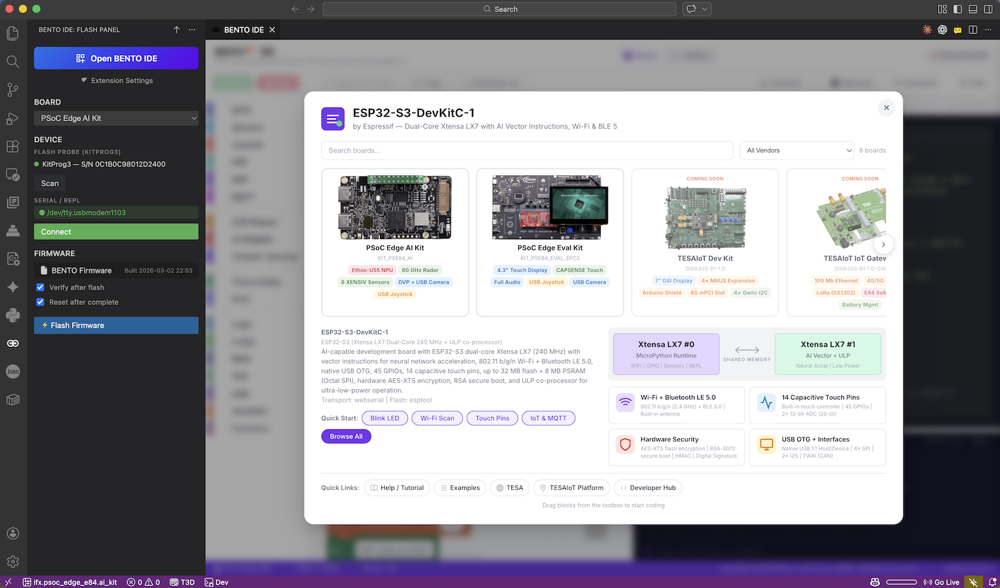

# BENTO<sup>◉⦿</sup> IDE — Make Anythings.

> **Turn Your Ideas into Reality with MicroPython & Embedded C**

---

## Screenshots



---

## Key Statistics

| Metric | Count |
|--------|-------|
| Example Programs | **163** (50 inline + 113 file-based) |
| Example Domains | **14** (Agriculture, Connectivity, Dashboard, Display, DSP, Factory, Game, GPIO, IoT, Joystick, Security, Sensor, System, UI) |
| Python→Blocks Converter | **113+ patterns** (AST-based reverse compiler) |
| BSP Targets Supported | **2** (AI Dev Kit + Eva Kit) |
| Total Source Code | **~12,000 lines** across 14 files |

---

## Hardware: PSoC Edge E84

The PSoC Edge E84 is a **dual-core Arm** platform by **Infineon** designed for Edge AI applications:

| Core | Role | Capabilities |
|------|------|-------------|
| **CM33_NS** | MicroPython + FreeRTOS | WiFi, MQTT, GPIO, I2C, Sensors, UART, OPTIGA Trust M |
| **CM55** | Edge AI + LVGL Display | ML Inference (Ethos-U55), Dashboard, Radar, USB Host |

### Supported Board Targets

| BSP Target | Board | Unique Features |
|------------|-------|-----------------|
| **KIT_PSE84_AI** | AI Dev Kit | 5 LEDs, DPS368+SHT40 sensors, Radar, ILI9341 LCD |
| **APP_KIT_PSE84_EVAL_EPC2** | Eva Kit | 3 LEDs, BMM350 Magnetometer, CapSense, Potentiometer |

### On-board Sensors & Peripherals

| Component | Description | Board |
|-----------|-------------|-------|
| **BMI270** | 6-axis IMU (Accelerometer + Gyroscope) | Both |
| **BMM350** | 3-axis Magnetometer (I3C) | Both |
| **DPS368** | Barometric Pressure + Temperature | AI Dev Kit |
| **SHT40** | Humidity + Temperature | AI Dev Kit |
| **CapSense** | Touch Buttons + Slider | Eva Kit |
| **Potentiometer** | Analog Input (SAR ADC) | Eva Kit |
| **XENSIV Radar** | BGT60TR13C Presence Detection | AI Dev Kit |
| **CYW55513** | WiFi 5 + Bluetooth | Both |
| **OPTIGA Trust M** | Hardware Security (TRNG, AES, ECDSA, Certs, Device ID) | Both |
| **ILI9341 LCD** | 800×480 TFT | Both |
| **USB Host** | HID Gamepad (Logitech F310 DirectInput Mode) | Both |

### Secure Inter-Processor Communication (Secure IPC)

```
CM33_NS (MicroPython)  <──Secure IPC Shared Memory──>  CM55 (FreeRTOS)
        │                                                      │
  WiFi, MQTT, GPIO                                   LVGL Dashboard
  Sensors (I2C/ADC)                                  Edge AI (Ethos-U55)
  OPTIGA Trust M                                     Radar Presence
  USB HID Joystick                                   USB Host Controller
```
---

## Features

### Block Programming
- **Google Blockly v11.2.1** with custom **Zelos renderer** and **TESAIoT theme**
- **17 block categories** with **102 custom blocks** covering 10 PSoC Edge modules
- **Custom blocks** mapped 1:1 to PSoC Edge MicroPython C modules
- **Quick Start templates**: Blink LED, Read Sensors, IoT Dashboard
- **Auto-save** workspace to localStorage

### Code Editor
- **Python syntax highlighting** with One Dark theme
- **Smart autocomplete** for **109 PSoC Edge MicroPython APIs**
  - Type `sensors.` to see all sensor functions
  - Type `wifi.` for WiFi, `mqtt.` for MQTT, `tesaiot.` for security, etc.
- **Dual mode**: Auto-generated (from blocks) or Editable (direct Python coding)
- View toggle: **Blocks** (read-only code) / **Python** (full editor)

### WebSerial Connection
- **USB-CDC** via KitProg3 (Chrome/Edge 89+)
- **MicroPython Raw REPL** protocol for code execution
- **Run** code directly on device (Ctrl+Enter)
- **Program** `main.py` to device filesystem
- **Terminal** with interactive REPL (115200 baud)
- **Keyboard interrupt** (Ctrl+C / Stop button)

### Help & API Reference Panel
- **35 modules/tutorials** documented with full API signatures, parameters, return types, examples, and board-specific workflow guidance
- **Searchable** — filter by module name, function, or keyword
- **Collapsible accordion** per module with chevron indicators
- **Resizable** — drag left edge to resize (380px–700px), saved to localStorage
- PSoC Edge Custom: sensors, gpio, lcd, wifi, mqtt, tesaiot, joystick, dsp, machine
- Standard Library: time, json, asyncio, math, os, random, hashlib, re, struct, collections, binascii, sys, deflate, io, array
- Tutorials: quick start, board differences, UI, sensors, joystick, LCD Console, system resources, stability rules, Example Explorer best practices, Web workflow, VSCode workflow

### Example Explorer (163 Examples)
- **163 examples** across 14 domains, generated from the firmware example trees plus curated inline samples
- **Difficulty levels**: 41 Beginner + 84 Intermediate + 38 Advanced
- **Filter & search**: Filter by domain, difficulty, or keyword search
- **Board-aware filtering**: Filter by AI Kit / Eval Kit / Both Boards using generated BSP tags
- **Preview modal**: View blocks + Python code before loading
- **113 file-based examples with blocks** mirrored from the firmware repositories, plus inline reference examples

### Python→Blocks Reverse Compiler
- **AST-based converter** (Skulpt parser) — convert Python code back to Blockly blocks
- **113+ recognized patterns** covering all custom PSoC Edge modules
- **Round-trip editing**: Edit Python → switch to Blocks → changes preserved
- **Graceful fallback**: Unrecognized code wrapped in `python_raw` blocks

---

## Block Categories (102 Custom Blocks)

### CM33 Core — MicroPython (Direct Hardware)

| Category | Color | Blocks | MicroPython Module | Description |
|----------|-------|--------|--------------------|-------------|
| **GPIO** | Blue | 10 | `machine.Pin`, `gpio` | BSP-aware LED/button control, pin init/read/write/toggle, interrupt |
| **Sensors** | Sky Blue | 27 | `sensors` | BMI270, DPS368, SHT40, BMM350, CapSense, Pot, Radar, Auto-push |
| **Joystick** | Indigo | 9 | `joystick` | USB HID F310 DirectInput: raw + 4 scenario modes |
| **DSP** | Teal | 20 | `dsp` | 6 filters (EMA, SMA, LPF, HPF, Median, Kalman), IMU, environment |
| **WiFi** | Purple | 7 | `wifi` | Station connect/scan, SoftAP mode, IP/status |
| **MQTT** | Magenta | 6 | `mqtt` | Connect, publish, subscribe, get_message |
| **Time** | Green | 4 | `time` | sleep, sleep_ms, ticks_ms, ticks_diff |
| **Print** | Indigo | 2 | built-in | print text, print value |

### CM55 Core — Edge AI + Display (Secure IPC)

| Category | Color | Blocks | MicroPython Module | Description |
|----------|-------|--------|--------------------|-------------|
| **LCD** | Amber | 2 | `lcd` | Print to LVGL display, clear screen |
| **TESAIoT Security** | Primary Purple | 15 | `tesaiot` | OPTIGA Trust M: crypto, credentials, counters, health |

### Standard Blockly

| Category | Blocks |
|----------|--------|
| Logic | if/else, compare, AND/OR/NOT, boolean, null, ternary |
| Loops | repeat, while/until, for, forEach, break/continue |
| Math | number, arithmetic, trig, constants, round, constrain, random |
| Text | string, join, append, length, indexOf, charAt, case, trim |
| Lists | create, repeat, length, indexOf, getIndex, setIndex |
| Variables | Create / set / get variables |
| Functions | Define / call functions with parameters and returns |

---

## Detailed Block Reference

### GPIO (10 blocks)

| Block | Type | Description |
|-------|------|-------------|
| `gpio_pin_init` | Statement | Initialize pin with mode (OUT, IN, PULL_UP, PULL_DOWN, OPEN_DRAIN) |
| `gpio_pin_write` | Statement | Write HIGH/LOW to pin |
| `gpio_pin_read` | Value | Read pin state → 0/1 |
| `gpio_pin_toggle` | Statement | Toggle pin output |
| `gpio_pin_irq` | Statement | Setup interrupt (FALLING/RISING/BOTH) |
| `gpio_led_on` / `off` / `toggle` | Statement | BSP-aware LED control (index 0–4) |
| `gpio_led_value` | Value | Read LED state |
| `gpio_button_pressed` | Value | Check button press → bool |
| `gpio_board_info` | Value | Get board info dict |
| `gpio_num_leds` / `num_buttons` | Value | Get BSP LED/button count |

Supports **35+ named pins** per BSP target including P-numbered pins and alias names.

### Sensors (27 blocks)

| Sensor | Blocks | Functions |
|--------|--------|-----------|
| **Core** | 5 | `init()`, `scan()`, `read_all()`, `push()`, `live_push(interval)` |
| **BMI270** (IMU) | 3 | `acceleration()` → (x,y,z), `gyroscope()` → (x,y,z), `temperature()` |
| **DPS368** (Pressure) | 3 | `pressure()` kPa, `temperature()`, `altitude()` m |
| **SHT40** (Humidity) | 2 | `temperature()`, `humidity()` %RH |
| **BMM350** (Mag) | 2 | `magnetic()` → (x,y,z) µT, `heading()` → 0–360° |
| **CapSense** | 3 | `read()` → dict, `buttons()` → tuple, `slider()` → 0–100 |
| **Potentiometer** | 3 | `read()` → raw, `percent()` → 0–100, `voltage()` → V |
| **Radar** | 3 | `radar()` → dict, `presence()` → bool, `energy()` → int |
| **Auto-Push** | 3 | `auto(enable)`, `auto_rate(ms)`, `auto_status()` |

### Joystick — USB HID F310 DirectInput (9 blocks)

| Block | Type | Description |
|-------|------|-------------|
| `joystick_init` | Statement | Initialize USB Host HID subsystem |
| `joystick_connected` | Value | Check if gamepad is plugged in → bool |
| `joystick_wait_connect` | Statement | Block until gamepad connected |
| `joystick_deadzone` | Statement | Set stick deadzone (0–50, default 10) |
| `joystick_info` | Value | Device info dict (VID, PID, name) |
| `joystick_read` | Value | **Raw mode**: all axes (0–255), 12 buttons, 8-way D-pad |
| `joystick_on_foot` | Value | **On Foot**: walk, camera, jump, run, action |
| `joystick_vehicle` | Value | **Vehicle**: steering, accel, brake, shift, clutch, horn, lights |
| `joystick_plane` | Value | **Plane**: aileron, elevator, rudder, throttle, engines |
| `joystick_boat` | Value | **Boat**: steering, throttle, rudder, reverse |

Supports **Logitech F310** in DirectInput mode (VID=046D, PID=C216).

### DSP — Signal Processing (20 blocks)

| Section | Blocks | Functions |
|---------|--------|-----------|
| **Filter Creation** | 6 | EMA (α), SMA (window 2–64), LPF (cutoff), HPF (cutoff), Median (window 3–15), Kalman (Q, R) |
| **Filter Operations** | 2 | `update(filter, sample)` → filtered value, `reset(filter)` |
| **IMU Algorithms** | 2 | `tilt(ax, ay, az)` → (roll°, pitch°), `compass(mx, my)` → heading 0–360° |
| **Environment** | 4 | `altitude(pressure, sea_level)`, `dew_point(temp, humidity)`, `heat_index(temp, humidity)`, `comfort_zone(temp, humidity)` |

All filters are stateful — create once, feed samples repeatedly.

### TESAIoT Security — OPTIGA Trust M (15 blocks)

| Section | Blocks | Functions |
|---------|--------|-----------|
| **Initialization** | 3 | `init()`, `device_id()` → 27 bytes, `license_verify()` → bool |
| **Credentials** | 3 | `cred_read(slot)`, `cred_write(slot, data)`, `cred_erase(slot)` |
| **Hardware TRNG** | 1 | `random(n)` → n random bytes |
| **Cryptography** | 4 | `hash(data)` SHA-256, `hmac(slot, data)` HMAC-SHA256, `sign(data)` ECDSA P-256, `slots()` |
| **AES Encryption** | 3 | `aes_keygen(bits)` 128/192/256, `encrypt(plaintext)` → (ct, iv), `decrypt(ct, iv)` → bytes |
| **Anti-Replay Counters** | 2 | `counter_read(id)` 4 counters (0–3), `counter_inc(id, step)` |
| **Device Health** | 1 | `health()` → dict (chip status, counters, memory) |

**14 Credential Slots:** device_id, license, mqtt_user, mqtt_pass, wifi_ssid, wifi_pass, api_key, user0–user3, cert, pkey, ca

### WiFi (7 blocks)

| Block | Type | Description |
|-------|------|-------------|
| `wifi_connect` | Statement | Connect to AP (SSID, password, WPA2) |
| `wifi_disconnect` | Statement | Disconnect from AP |
| `wifi_scan` | Value | Scan available networks → list |
| `wifi_is_connected` | Value | Check connection status → bool |
| `wifi_ip` | Value | Get assigned IP address → str |
| `wifi_status` | Value | Full status dict (IP, SSID, RSSI, MAC) |
| `wifi_softap` | Statement | Start SoftAP mode (default: PSoC-Edge-MPY / micropython) |

### MQTT (6 blocks)

| Block | Type | Description |
|-------|------|-------------|
| `mqtt_connect` | Statement | Connect to broker (host, port 1883, client_id) |
| `mqtt_publish` | Statement | Publish message with QoS 0/1 |
| `mqtt_subscribe` | Statement | Subscribe to topic |
| `mqtt_get_message` | Value | Get last message (non-blocking) → dict or None |
| `mqtt_is_connected` | Value | Check connection → bool |
| `mqtt_disconnect` | Statement | Disconnect from broker |

### LCD Display (2 blocks)

| Block | Type | Description |
|-------|------|-------------|
| `lcd_print` | Statement | Print text to LVGL display (Secure IPC, max 127 chars) |
| `lcd_clear` | Statement | Clear display |

---

## API Reference Panel — Module List

### PSoC Edge Custom Modules (9)

| Module | Functions | Submodules | Description |
|--------|-----------|------------|-------------|
| `sensors` | 5 core + 3 auto | 6 sensor sub-modules | Multi-sensor hub with auto-push |
| `gpio` | 10 | — | BSP-aware LED/button + pin control |
| `lcd` | 2 | — | LVGL display via Secure IPC |
| `wifi` | 7 | — | CYW55513 WiFi (Station + SoftAP) |
| `mqtt` | 6 | — | MQTT 3.1.1 client (cy_mqtt) |
| `tesaiot` | 17 | — | OPTIGA Trust M security (14 slots, 4 counters) |
| `joystick` | 9 | — | USB HID gamepad (5 scenario modes) |
| `dsp` | 14 | — | Signal processing (6 filters + IMU + environment) |
| `machine` | 6 | — | GPIO pins, I2C, PDM microphone |

### Standard Library Modules (15)

| Module | Description |
|--------|-------------|
| `time` | Delays (sleep, sleep_ms), ticks (ticks_ms, ticks_diff, ticks_add) |
| `json` | JSON encode/decode (dumps, loads) |
| `asyncio` | Async coroutines (create_task, sleep, gather, Event, Lock) |
| `math` | Math functions (sin, cos, sqrt, log, pi, e, floor, ceil) |
| `os` | File system (listdir, mkdir, remove, rename, stat, statvfs, uname) |
| `random` | PRNG (random, randint, randrange, uniform, choice, seed) |
| `hashlib` | SHA-256 hashing (sha256, update, digest, hexdigest) |
| `re` | Regular expressions (match, search, sub, split, compile) |
| `struct` | Binary pack/unpack (pack, unpack — big/little endian) |
| `collections` | OrderedDict (insertion-ordered), deque (fixed-size FIFO) |
| `binascii` | Hex/base64 encoding (hexlify, unhexlify, b2a_base64, a2b_base64) |
| `sys` | System info (version, platform, modules, path, byteorder) |
| `deflate` | zlib compression (DeflateIO for compress/decompress streams) |
| `io` | In-memory streams (BytesIO, StringIO) |
| `array` | Typed arrays (array with typecodes: b, B, h, H, i, I, f, d) |

---

## Keyboard Shortcuts

| Shortcut | Action |
|----------|--------|
| `Ctrl+Enter` | Run code on device |
| `Ctrl+S` | Copy code to clipboard |
| `Ctrl+Shift+T` | Toggle terminal panel |
| `?` | Open/close API Reference panel |
| `Escape` | Close Welcome card or API Reference panel |

---

## License

Apache-2.0

---

## Links

| Resource | URL |
|----------|-----|
| **TESA** | https://www.tesa.or.th |
| **TESAIoT Platform** | https://www.tesaiot.com |
| **Developer Hub** | https://tesaiot.github.io/developer-hub/ |
